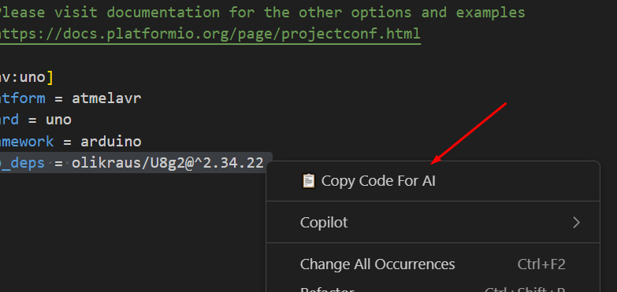
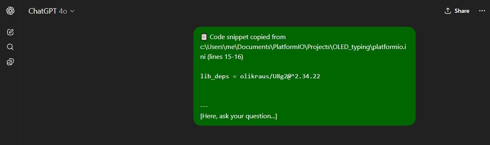

# 📋 Copy for AI 

Easily copy code from VS Code with project, file, and context details – ready to paste into ChatGPT or any AI tool.  

## 📸 Screenshots

  
*Fig. 1 – Access the command from the right‑click menu or use `Ctrl + Shift + C`.*  

  
*Fig. 2 – Paste directly into ChatGPT (`Ctrl + V`) with context included.*  

## 🚀 Why use Copy for AI?  
✔️ No need to type triple backticks ` ``` ` every time.  
✔️ Automatically includes project name, file path, and line numbers.  
✔️ Adds a few surrounding context lines for clarity.  
✔️ Outputs clean, Markdown‑formatted code ready for AI.  

## 🛠 How to Use  
1. **Select the code** you want in VS Code.  
2. Run **Copy for AI** from:  
   - Right‑click context menu  
   - Command Palette  
   - Or press `Ctrl + Shift + C`  
3. **Paste (`Ctrl + V`)** into ChatGPT (or any AI tool) and start asking questions.  

## 📦 Get it on VS Code Marketplace 

➡ [https://marketplace.visualstudio.com/items?itemName=SidaLiu.copyforai](https://marketplace.visualstudio.com/items?itemName=SidaLiu.copyforai)