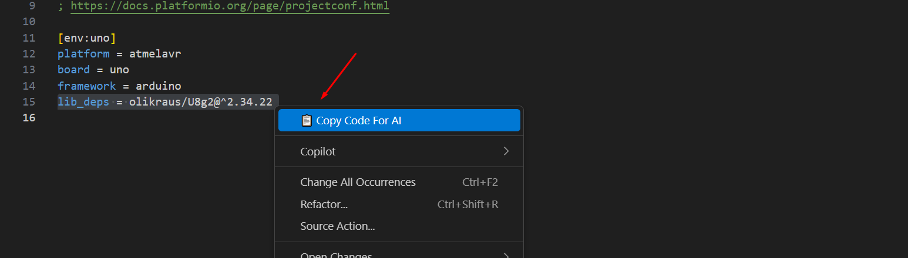

# Copy for AI

Copy code from VS Code with project, file, and context information – ready to paste into ChatGPT or other AI tools.

  
Fig. 1 *This is where you find the command in VS Code.*

  
Fig. 2 *This is how it looks when you paste into ChatGPT.*

## Features
- Adds a **Copy for AI** command to the editor menu.
- Copies selected text with project name, file name, and line numbers.
- Includes a few surrounding context lines.
- Outputs as clean, Markdown-formatted text for AI to read.

## Usage
1. Select code in VS Code.
2. Run **Copy for AI** from the context menu or Command Palette or (`Ctrl+Shift+C`).
3. Paste into ChatGPT (`Ctrl+V`).
